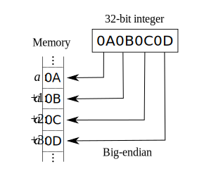

> Describe and compare fail-fast and fail-safe iterators. Give examples.

https://www.toptal.com/java/interview-questions
https://docs.oracle.com/javase/tutorial/tutorialLearningPaths.html

---

## Understanding JVM Internals
https://www.cubrid.org/blog/understanding-jvm-internals/

* Java Virtual Machine (JVM) - analyzes and executes Java byte code

### Virtual Machine
The **Virtual machine** is a software implementation of a machine (computer), executing programs like a physical machine. **WORA**, or write once, run anywhere is what the java VM was originally built for. 

JVM Features:
* **Stack-based** - x86 and ARM run based on a register. JVM runs based on a stack.
* **Symbolic reference** - All types (class and interface) *except for primitives* are referred to ythrough symbolic reference, instead of through explicit memory address-based reference.
* **Garbage collection** - Class instances are explicitly created by the user code, and automatically destroyed by the GC.
* **Clearly defined primitive data types** - Unlike C/C++, the JVM clearly defines the primitive data types to maintain compatibility and guarantee platform independence.
* **Network byte order** - Java class files use network byte order. This is to maintain platform independence between the little endian used by Intel x86 and the big endian by RISC. JVM uses the network byte order, which is used for network transfer. Network byte order is big endian byte order.



Differnt VMs:
* Oracle Hotspot JVM
* Oracle JRockit
* IBM J9
* SAP JVM
* Azul Zulu
* Azul Zing
* Google's Android JVM, Dalvik, though not byte code compatible since it's register based

### Java bytecode
We can use tools like **javap** to disassemble class files into human-readable bytecode. As an example, the following method:

```java
// UserService.java
…
public void add(String userName) {
    admin.addUser(userName);
}
```

would look like this:

```java
public void add(java.lang.String);
  Code:
   0:   aload_0
   1:   getfield        #15; //Field admin:Lcom/nhn/user/UserAdmin;
   4:   aload_1
   5:   invokevirtual   #23; //Method com/nhn/user/UserAdmin.addUser:(Ljava/lang/String;)V
   8:   return
```

The fourth instruction uses **invokevirtual** to invoke the method corresponding to the 23rd index. The *javap* program annotates the method with the name and namespace added as a comment. 

These are the OpCodes that invoke a method in Java Bytecode:
* **invokeinterface** - invokes an interface method
* **invokespecial** - invokes an initializer, private method, or superclass method
* **invokestatic** - invokes static methods
* **invokevirtual** - invokes instance methods

The instruction set of Java Bytecode consists of OpCode and Operand. In this case, the OpCode for invokevirtual requires a 2-byte Operand. The number in front of the instruction is the byte number. Instruction OpCodes such as *aload_0*, *getfield*, and *invokevirtual* are expressed as a 1-byte byte number (*aload_0* = 0x2a, *getfield* = 0xb4, *invokevirtual* = 0xb6). Therefore, the maximum number of OpCodes is limited to 256.

OpCodes such as aload_0 and aload_1 don't need any Operand, that's they the next instruction follows with the next byte. However, getfield and invokevirtual require the 2-byte Operand, and thus, the next instruction is written on the fourth byte, skipping two additional bytes. The resulting bytecode in the class file looks like this then:

```
2a b4 00 0f 2b b6 00 17 57 b1
```

In the Java Bytecode, the class instance is expressed as "L;" and void is expressed as "V". In this way, other types have their own expressions. The following table summarizes the epxressions:

|Java Bytecode|Type     |Description                          |
|-------------|---------|-------------------------------------|
|B            |byte     |signed byte                          |
|C            |char     |Unicode character                    |
|D            |double   |double-precision floating-point value|
|F            |float    |single-precision floating-point value|
|I            |int      |integer                              |
|J            |long     |long integer                         |
|L<classname> |reference|an instance of class <classname>     |
|S            |short    |signed short                         |
|Z            |boolean  |true or false                        |
|[            |reference|one array dimension                  |

*Example Bytecode expressions*
|Java Code                                 |Java Bytecode Expression                |
|------------------------------------------|----------------------------------------|
|double d[][][];                           |[[[D                                    |
|Object mymethod(int I, double d, Thread t)|(IDLjava/lang/Thread;)Ljava/lang/Object;|

### Class File Format
In Java, the size of one method cannot be more than 65535 bytes. 

The **goto** and **jsr** instructions have a 2-byte signed branch offset as their Operand, so they can be expanded to the 65535th index at a maximum. To support a more sufficient branch, **goto_w** and **jsr_w** are supported and receive a 4-byte signed branch offset.

** Class file format outline **

```java
ClassFile {
    u4 magic;
    u2 minor_version;
    u2 major_version;
    u2 constant_pool_count;
    cp_info constant_pool[constant_pool_count-1];
    u2 access_flags;
    u2 this_class;
    u2 super_class;
    u2 interfaces_count;
    u2 interfaces[interfaces_count];
    u2 fields_count;
    field_info fields[fields_count];
    u2 methods_count;
    method_info methods[methods_count];
    u2 attributes_count;
    attribute_info attributes[attributes_count];}
```

A sample *.class* file might look like this in a hex editor:

```
ca fe ba be 00 00 00 32 00 28 07 00 02 01 00 1b
```

* **magic:** The first 4 bytes of the class file are the magic number. This is a pre-specified value to distinguish the Java class file. As shown in the Hex Editor above, the value is always 0xCAFEBABE. In short, when the first 4 bytes of a file is 0xCAFEBABE, it can be regarded as the Java class file. This is a kind of "witty" magic number related to the name "Java".
* **minor_version, major_version:** The next 4 bytes indicate the class version. As the UserService.class file is 0x00000032, the class version is 50.0. The version of a class file compiled by JDK 1.6 is 50.0, and the version of a class file compiled by JDK 1.5 is 49.0. The JVM must maintain backward compatibility with class files compiled in a lower version than itself. On the other hand, when a upper-version class file is executed in the lower-version JVM, java.lang.UnsupportedClassVersionError occurs.
* **constant_pool_count, constant_pool[]:** Next to the version, the class-type constant pool information is described. This is the information included in the Runtime Constant Pool area, which will be explained later. While loading the class file, the JVM includes the constant_pool information in the Runtime Constant Pool area of the method area. As the constant_pool_count of the UserService.class file is 0x0028, you can see that the constant_pool has (40-1) indexes, 39 indexes.
* **access_flags:** This is the flag that shows the modifier information of a class; in other words, it shows public, final, abstract or whether or not to interface.
* **this_class, super_class:** The index in the constant_pool for the class corresponding to this and super, respectively.
* **interfaces_count, interfaces[]:** The index in the the constant_pool for the number of interfaces implemented by the class and each interface.
* **fields_count, fields[]:** The number of fields and the field information of the class. The field information includes the field name, type information, modifier, and index in the constant_pool.
* **methods_count, methods[]:** The number of methods in a class and the methods information of the class. The methods information includes the methods name, type and number of the parameters, return type, modifier, index in the constant_pool, execution code of the method, and exception information.
* **attributes_count, attributes[]:** The attribute_info structure has various attributes. For field_info or method_info, attribute_info is used.

### JVM Structure


A class loader loads the compiled Java Bytecode to the Runtime Data Areas, and the execution engine executes the Java Bytecode.


#### Class Loader

Class loading is done dynamically in the JVM. Loading and linking of a class happens the first time it's referenced during runtime, not compile time.


Class Loader features:

* **Hierarchical Structure:** Class loaders in Java are organized into a hierarchy with a parent-child relationship. The Bootstrap Class Loader is the parent of all class loaders.
* **Delegation mode:** Based on the hierarchical structure, load is delegated between class loaders. When a class is loaded, the parent class loader is checked to determine whether or not the class is in the parent class loader. If the upper class loader has the class, the class is used. If not, the class loader requested for loading loads the class.
* **Visibility limit:** A child class loader can find the class in the parent class loader; however, a parent class loader cannot find the class in the child class loader.
* **Unload is not allowed:** A class loader can load a class but cannot unload it. Instead of unloading, the current class loader can be deleted, and a new class loader can be created.

Class loader delegation model:


---

## Monitoring tools
JFR - https://docs.oracle.com/javacomponents/jmc-5-5/jfr-runtime-guide/toc.htm
Troubleshooting (Java 8) - https://docs.oracle.com/javase/8/docs/technotes/guides/troubleshoot/toc.html

## What's new in Java 8
> http://www.baeldung.com/java-8-new-features

## What's new in Java 9
> https://docs.oracle.com/javase/9/whatsnew/toc.htm
> http://www.baeldung.com/new-java-9

## Garbage Collector
https://docs.oracle.com/javase/9/gctuning/toc.htm
