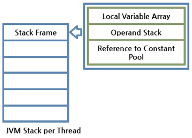

> Describe and compare fail-fast and fail-safe iterators. Give examples.

https://www.toptal.com/java/interview-questions
https://docs.oracle.com/javase/tutorial/tutorialLearningPaths.html

---

## Understanding JVM Internals
https://www.cubrid.org/blog/understanding-jvm-internals/

* Java Virtual Machine (JVM) - analyzes and executes Java byte code

### Virtual Machine
The **Virtual machine** is a software implementation of a machine (computer), executing programs like a physical machine. **WORA**, or write once, run anywhere is what the java VM was originally built for. 

JVM Features:
* **Stack-based** - x86 and ARM run based on a register. JVM runs based on a stack.
* **Symbolic reference** - All types (class and interface) *except for primitives* are referred to ythrough symbolic reference, instead of through explicit memory address-based reference.
* **Garbage collection** - Class instances are explicitly created by the user code, and automatically destroyed by the GC.
* **Clearly defined primitive data types** - Unlike C/C++, the JVM clearly defines the primitive data types to maintain compatibility and guarantee platform independence.
* **Network byte order** - Java class files use network byte order. This is to maintain platform independence between the little endian used by Intel x86 and the big endian by RISC. JVM uses the network byte order, which is used for network transfer. Network byte order is big endian byte order.


Differnt VMs:
* Oracle Hotspot JVM
* Oracle JRockit
* IBM J9
* SAP JVM
* Azul Zulu
* Azul Zing
* Google's Android JVM, Dalvik, though not byte code compatible since it's register based

### Java bytecode
We can use tools like **javap** to disassemble class files into human-readable bytecode. As an example, the following method:

```java
// UserService.java
…
public void add(String userName) {
    admin.addUser(userName);
}
```

would look like this:

```java
public void add(java.lang.String);
  Code:
   0:   aload_0
   1:   getfield        #15; //Field admin:Lcom/nhn/user/UserAdmin;
   4:   aload_1
   5:   invokevirtual   #23; //Method com/nhn/user/UserAdmin.addUser:(Ljava/lang/String;)V
   8:   return
```

The fourth instruction uses **invokevirtual** to invoke the method corresponding to the 23rd index. The *javap* program annotates the method with the name and namespace added as a comment. 

These are the OpCodes that invoke a method in Java Bytecode:
* **invokeinterface** - invokes an interface method
* **invokespecial** - invokes an initializer, private method, or superclass method
* **invokestatic** - invokes static methods
* **invokevirtual** - invokes instance methods

The instruction set of Java Bytecode consists of OpCode and Operand. In this case, the OpCode for invokevirtual requires a 2-byte Operand. The number in front of the instruction is the byte number. Instruction OpCodes such as *aload_0*, *getfield*, and *invokevirtual* are expressed as a 1-byte byte number (*aload_0* = 0x2a, *getfield* = 0xb4, *invokevirtual* = 0xb6). Therefore, the maximum number of OpCodes is limited to 256.

OpCodes such as aload_0 and aload_1 don't need any Operand, that's they the next instruction follows with the next byte. However, getfield and invokevirtual require the 2-byte Operand, and thus, the next instruction is written on the fourth byte, skipping two additional bytes. The resulting bytecode in the class file looks like this then:

```
2a b4 00 0f 2b b6 00 17 57 b1
```

In the Java Bytecode, the class instance is expressed as "L;" and void is expressed as "V". In this way, other types have their own expressions. The following table summarizes the epxressions:

|Java Bytecode|Type     |Description                          |
|-------------|---------|-------------------------------------|
|B            |byte     |signed byte                          |
|C            |char     |Unicode character                    |
|D            |double   |double-precision floating-point value|
|F            |float    |single-precision floating-point value|
|I            |int      |integer                              |
|J            |long     |long integer                         |
|L<classname> |reference|an instance of class <classname>     |
|S            |short    |signed short                         |
|Z            |boolean  |true or false                        |
|[            |reference|one array dimension                  |

*Example Bytecode expressions*
|Java Code                                 |Java Bytecode Expression                |
|------------------------------------------|----------------------------------------|
|double d[][][];                           |[[[D                                    |
|Object mymethod(int I, double d, Thread t)|(IDLjava/lang/Thread;)Ljava/lang/Object;|

### Class File Format
In Java, the size of one method cannot be more than 65535 bytes. 

The **goto** and **jsr** instructions have a 2-byte signed branch offset as their Operand, so they can be expanded to the 65535th index at a maximum. To support a more sufficient branch, **goto_w** and **jsr_w** are supported and receive a 4-byte signed branch offset.

** Class file format outline **

```java
ClassFile {
    u4 magic;
    u2 minor_version;
    u2 major_version;
    u2 constant_pool_count;
    cp_info constant_pool[constant_pool_count-1];
    u2 access_flags;
    u2 this_class;
    u2 super_class;
    u2 interfaces_count;
    u2 interfaces[interfaces_count];
    u2 fields_count;
    field_info fields[fields_count];
    u2 methods_count;
    method_info methods[methods_count];
    u2 attributes_count;
    attribute_info attributes[attributes_count];}
```

A sample *.class* file might look like this in a hex editor:

```
ca fe ba be 00 00 00 32 00 28 07 00 02 01 00 1b
```

* **magic:** The first 4 bytes of the class file are the magic number. This is a pre-specified value to distinguish the Java class file. As shown in the Hex Editor above, the value is always 0xCAFEBABE. In short, when the first 4 bytes of a file is 0xCAFEBABE, it can be regarded as the Java class file. This is a kind of "witty" magic number related to the name "Java".
* **minor_version, major_version:** The next 4 bytes indicate the class version. As the UserService.class file is 0x00000032, the class version is 50.0. The version of a class file compiled by JDK 1.6 is 50.0, and the version of a class file compiled by JDK 1.5 is 49.0. The JVM must maintain backward compatibility with class files compiled in a lower version than itself. On the other hand, when a upper-version class file is executed in the lower-version JVM, java.lang.UnsupportedClassVersionError occurs.
* **constant_pool_count, constant_pool[]:** Next to the version, the class-type constant pool information is described. This is the information included in the Runtime Constant Pool area, which will be explained later. While loading the class file, the JVM includes the constant_pool information in the Runtime Constant Pool area of the method area. As the constant_pool_count of the UserService.class file is 0x0028, you can see that the constant_pool has (40-1) indexes, 39 indexes.
* **access_flags:** This is the flag that shows the modifier information of a class; in other words, it shows public, final, abstract or whether or not to interface.
* **this_class, super_class:** The index in the constant_pool for the class corresponding to this and super, respectively.
* **interfaces_count, interfaces[]:** The index in the the constant_pool for the number of interfaces implemented by the class and each interface.
* **fields_count, fields[]:** The number of fields and the field information of the class. The field information includes the field name, type information, modifier, and index in the constant_pool.
* **methods_count, methods[]:** The number of methods in a class and the methods information of the class. The methods information includes the methods name, type and number of the parameters, return type, modifier, index in the constant_pool, execution code of the method, and exception information.
* **attributes_count, attributes[]:** The attribute_info structure has various attributes. For field_info or method_info, attribute_info is used.

### JVM Structure


A class loader loads the compiled Java Bytecode to the Runtime Data Areas, and the execution engine executes the Java Bytecode.


#### Class Loader

Class loading is done dynamically in the JVM. Loading and linking of a class happens the first time it's referenced during runtime, not compile time.


Class Loader features:

* **Hierarchical Structure:** Class loaders in Java are organized into a hierarchy with a parent-child relationship. The Bootstrap Class Loader is the parent of all class loaders.
* **Delegation mode:** Based on the hierarchical structure, load is delegated between class loaders. When a class is loaded, the parent class loader is checked to determine whether or not the class is in the parent class loader. If the upper class loader has the class, the class is used. If not, the class loader requested for loading loads the class.
* **Visibility limit:** A child class loader can find the class in the parent class loader; however, a parent class loader cannot find the class in the child class loader.
* **Unload is not allowed:** A class loader can load a class but cannot unload it. Instead of unloading, the current class loader can be deleted, and a new class loader can be created.


Class loader delegation model:


When a class loader is requested for class load, it checks whether or not the class exists in the class loader cache, the parent class loader, and itself, in the order listed. In short, it checks whether or not the class has been loaded in the class loader cache. If not, it checks the parent class loader. If the class is not found in the bootstrap class loader, the requested class loader searches for the class in the file system.

* **Bootstrap class loader:** This is created when running the JVM. It loads Java APIs, including object classes. Unlike other class loaders, it is implemented in native code instead of Java.
* **Extension class loader:** It loads the extension classes excluding the basic Java APIs. It also loads various security extension functions.
* **System class loader:** If the bootstrap class loader and the extension class loader load the JVM components, the system class loader loads the application classes. It loads the class in the $CLASSPATH specified by the user.
* **User-defined class loader:** This is a class loader that an application user directly creates on the code.


**Why write a custom class loader?**

You might want to write your own class loader so that you can load classes from an alternate repository, partition user code, or unload classes.

There are three main reasons why you might want to write your own class loader.

1. To allow class loading from alternative repositories.
    This is the most common case, in which an application developer might want to load classes from other locations, for example, over a network connection.

2. To partition user code.
    This case is less frequently used by application developers, but widely used in servlet engines.

3. To allow the unloading of classes.
    This case is useful if the application creates large numbers of classes that are used for only a finite period. Because a class loader maintains a cache of the classes that it has loaded, these classes cannot be unloaded until the class loader itself has been dereferenced. For this reason, system and extension classes are never unloaded, but application classes can be unloaded when their class loader is.


### Linking
If a class loader finds an unloaded class, the class is loaded and linked by following the process as illusrated below:


* **Loading:** A class is obtained from a file and loaded to the JVM memory.
* **Verifying:** Check whether or not the read class is configured as described in the Java Language Specification and JVM specifications. This is the most complicated test process of the class load processes, and takes the longest time. Most cases of the JVM TCK test cases are to test whether or not a verification error occurs by loading wrong classes.
* **Preparing:** Prepare a data structure that assigns the memory required by classes and indicates the fields, methods, and interfaces defined in the class.
* **Resolving:** Change all symbolic references in the constant pool of the class to direct references.
* **Initializing:** Initialize the class variables to proper values. Execute the static initializers and initialize the static fields to the configured values.

### Runtime Data Areas
Runtime data areas are the memory areas assigned when the JVM program runs on the OS. These areas can be divided into 6 sections. The *PC Register*, *JVM Stack*, and the *Native Method Stack* areas are created on a per thread basis. The *heap*, *method area*, and the *runtime constant pool* are shared by all threads.


* **PC Register:** One Program Counter (PC) register exists per thread and is created when the thread is started. The PC register has the address of a JVM instruction being executed now.
* **JVM Stack:** One JVM stack exists per thread and is created when the thread is started. This stack saves the struct (stack frame) and the jvm just pushes or pops the stack frame to the JVM Stack. If any exception occurs, each line of the stack trace shown when using a method such as `printStackTrace()` represents one stack frame.
* **Native Method Stack:** A stack for native code written in a language other than java. This is related to JNI and has its own area.
* **Method Area:** The ethod area is shared by all threads, created when the JVM starts. It stores runtime constant pool, field and method information, static variable and method bytecode for each of the classes and interfaces read by the JVM. The method area can be implemented in various formats by JVM vendor. Oracle Hotspot JVM calls it the *Permanent Area* or *Permanent Generation(PermGen)*. The garbage collection for the method area is optional for each JVM vendor.
* **Runtime constant pool:** An area that corresponds to the constant_pool table in the class file format. This area is included in the method area; however it plays the most core role in JVM operation. Therefore, the JVM specification separately describes its importance. As well as the constant of each class and interface, it contains all references for methods and fields. In short, when a method or field is referred to, the JVM searches the actual address of the method or field on the memory by using the runtime constant pool.
* **Heap:** A space that stores instances or objects, and is a target of garbage collection. This space is most frequently mentioned when discussing issues such as JVM performance. JVM vendors can determine how to configure the heap or not to collect garbage.




* **Stack Frame:** One stack frame is created whenever a method is executed in the JVM, and the stack frame is added to the JVM stack of the thread. When the method is ended, the stack frame is removed. Each stack frame has the reference for *local variable array*, *operand stack*, and *runtime constant pool* of a class where the method being executed belongs. The size of local variable array and operand stack is determined when compiling, therefore the size of the stack frame is fixed according to the method.
* **Local variable array:** Starting at 0, where the first entry is the reference of a class instance where the method belongs. From 1, the method parameters are stored first, then followed by the local variables of the method.
* **Operand stack:** The actual workspace of a method. Each method exchanges data between the operand stack and the local variable array, and pushes and pop other method invoke results. The necessary size of the operand stack space can be determined during compilation and therefore fixes the size of the operand stack during compilation.


### An example
Using the previous method as an example
```java
// UserService.java
...
public void add(String userName) {
    admin.addUser(userName);
}
```

We get the following bytecode (human-readable using *javap -c*):
```java
public void add(java.lang.String);
  Code:
   0:   aload_0
   1:   getfield        #15; //Field admin:Lcom/nhn/user/UserAdmin;
   4:   aload_1
   5:   invokevirtual   #23; //Method com/nhn/user/UserAdmin.addUser:(Ljava/lang/String;)Lcom/nhn/user/User;
   8:   pop
   9:   return
```
As mentioned earlier, the JVM is stack based and thus doesn't write register name, memory addressor or offset on the operand (unlike x86 or RISC for example). It uses index numbers, such as 15 and 23 instead of memory addresses since it manages the memory itself. These indexes are found in the *constant pool* of the current class (`UserService.class`). In short, the JVM creates a constant pool for each class, and the pool stores the reference of the actual target.

Each row of the disassembled code is interpreted as follows then:

* **aload_0:** Add the #0 index of the local variable array to the Operand stack. The #0 index of the local variable array is always this, the reference for the current class instance.
* **getfield #15:** In the current class constant pool, add the #15 index to the Operand stack. UserAdmin admin field is added. Since the admin field is a class instance, a reference is added.
* **aload_1:** Add the #1 index of the local variable array to the Operand stack. From the #1 index of the local variable array, it is a method parameter. Therefore, the reference of String userName sent while invoking add() is added.
* **invokevirtual #23:** Invoke the method corresponding to the #23 index in the current class constant pool. At this time, the reference added by using getfield and the parameter added by using aload_1 are sent to the method to invoke. When the method invocation is completed, add the return value to the Operand stack.
* **pop:** Pop the return value of invoking by using invokevirtual from the Operand stack. You can see that the code compiled by the previous library has no return value. In short, the previous has no return value, so there was no need to pop the return value from the stack.
* **return:** Complete the method.


For reference, in this method, no local variable array has been changed. So the figure above displays the changes in Operand stack only. However, in most cases, local variable array is also changed. Data transfer between the local variable array and the Operand stack is made by using a lot of load instructions (aload, iload) and store instructions (astore, istore). 

In this figure, we have checked the brief description of the runtime constant pool and the JVM stack. When the JVM runs, each class instance will be assigned to the heap, and class information including User, UserAdmin, UserService, and String will be stored in the method area.

## Execution Engine
The execution engine is tasked with actually executing the bytecode that is assigned to the runtime data areas in the JVM via class loader. The engine reads the bytecode (OpCode + Operand) and executes it one-by-one. 

Since the java bytecode is written for the JVM, which runs on the OS, there's still a step missing. The execution engine must change the java bytecode into machine code of the OS the JVM is currently executing on.
There's two ways to accomplish this:

* **Interpreter:** Reads, interprets and executes the bytecode instructions one by one. As it interprets and executes instructions this way, it can quickly interpret one bytecode, but slowly executes the interpreted result. This is the disadvantage of an interpreted language.
* **JIT (Just-In-Time) compiler:** The JIT compiler has been introduced to compensate for the disadvantages of the interpreter. The execution engine runs as an interpreter first, and at the appropriate time, the JIT compiler compiles the entire bytecode to change it to native code. After that, the execution engine no longer interprets the method, but directly executes using native code. Execution in native code is much faster than interpreting instructions one by one. The compiled code can be executed quickly since the native code is stored in the cache.

The tradeoff for JIT is that it takes more time for the compiler to compile the code than it for the interpreter to interpret the code one by one. Therefore, if the code is only run once, it's better to just use the interpreter. However, if it's run more than once, it's better to compile. To get the best of both worlds, modern JVMs analyze and keep track of how often code is run, and after passing a certain threshold will use the JIT compiler to speed up subsequent execution.


Most JIT compilers run as shown in the figure below:


The JIT compiler converts the bytecode to an intermediate-level expression, IR (Intermediate Representation), to execute optimization, and then converts the expression to native code.

Oracle Hotspot VM uses a JIT compiler called Hotspot Compiler. It is called Hotspot because Hotspot Compiler searches the 'Hotspot' that requires compiling with the highest priority through profiling, and then it compiles the hotspot to native code. If the method that has the bytecode compiled is no longer frequently invoked, in other words, if the method is not the hotspot any more, the Hotspot VM removes the native code from the cache and runs in interpreter mode. The Hotspot VM is divided into the Server VM and the Client VM, and the two VMs use different JIT compilers.


The client VM and the server VM use an identical runtime; however, they use different JIT compilers, as shown in the above figure. The client VM and the server VM use an identical runtime, however, they use different JIT compilers as shown in the above figure. Advanced Dynamic Optimizing Compiler used by the server VM uses more complex and diverse performance optimization techniques.

IBM JVM has introduced AOT (Ahead-Of-Time) Compiler from IBM JDK 6 as well as the JIT compiler. This means that many JVMs share the native code compiled through the shared cache. In short, the code that has been already compiled through the AOT compiler can be used by another JVM without compiling. In addition, IBM JVM provides a fast way of execution by pre-compiling code to JXE (Java EXecutable) file format using the AOT compiler.

Most Java performance improvement is accomplished by improving the execution engine. As well as the JIT compiler, various optimization techniques are being introduced so the JVM performance can be continuously improved. The biggest difference between the initial JVM and the latest JVM is the execution engine.

Hotspot compiler has been introduced to Oracle Hotspot VM from version 1.3, and JIT compiler has been introduced to Dalvik VM from Android 2.2.

---

## Monitoring tools
JFR - https://docs.oracle.com/javacomponents/jmc-5-5/jfr-runtime-guide/toc.htm
Troubleshooting (Java 8) - https://docs.oracle.com/javase/8/docs/technotes/guides/troubleshoot/toc.html

## What's new in Java 8
> http://www.baeldung.com/java-8-new-features

## What's new in Java 9
> https://docs.oracle.com/javase/9/whatsnew/toc.htm
> http://www.baeldung.com/new-java-9

## Garbage Collector
https://docs.oracle.com/javase/9/gctuning/toc.htm
